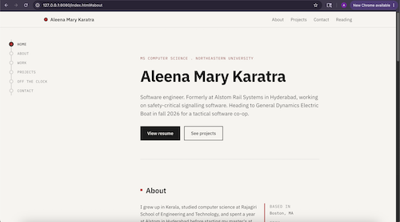

# Aleena Mary Karatra — Personal Homepage

Personal homepage built for **CS 5610: Web Development** at Northeastern University, Fall 2025. Class taught by Prof. John Guerra.

Class link: <https://johnguerra.co/classes/webDevelopment_fall_2025/>

## Project objective

Build a static personal homepage using vanilla HTML5, CSS3, and ES6 modules (no frameworks, no jQuery). The site is themed lightly after the Hyderabad Metro — a thin red line runs down the left margin of the page, and the section the visitor is currently reading lights up on the line. The theme connects to a year I spent at Alstom in Hyderabad working on rail signalling software.

## Screenshot



## Pages

- `index.html` — homepage with hero, about, work, projects, off-the-clock, and contact sections
- `projects.html` — full project detail page
- `resume.html` — résumé
- `recommendations.html` — book recommendations generated by an LLM (the required AI-generated third page)

## Build / run

This is a static site, no build step. To run locally:

```bash
npm install     # only needed if you want lint/format/dev-server
npm start       # serves on http://localhost:8080
```

Or just open `index.html` directly in a browser. To deploy, push to a GitHub repo and enable GitHub Pages on the main branch.

## Stack

- HTML5
- CSS3 (custom; Bootstrap 5 grid utilities only)
- Vanilla JavaScript (ES6 modules, `type="module"` everywhere)
- IBM Plex Sans and IBM Plex Mono (Google Fonts)
- Deployed on GitHub Pages

## File layout

```
.
├── index.html
├── projects.html
├── resume.html
├── recommendations.html
├── css/
│   └── main.css
├── js/
│   ├── main.js
│   ├── metroLine.js
│   └── footer.js
├── images/
│   └── favicon.svg
├── docs/
│   └── design.md
├── package.json
├── eslint.config.js
├── .prettierrc
├── LICENSE
└── README.md
```

## Creative component

The metro-line scrollspy (`js/metroLine.js`). As the user scrolls, each section is observed via `IntersectionObserver`; the station label corresponding to the section currently in view gets an `is-active` class, and prior stations get `is-visited`. Clicking any station scrolls the page to its section.

## Design Document

The design document is available under the directory docs at : `docs/Project1_Design_Document.pdf`.

## Use of GenAI

I used a large language model (`claude-opus-4-7`) during this project. Specifically:

- **Reading recommendations page**: The book list on `recommendations.html` is genuinely LLM-generated — that page is the required AI-generated page for the assignment, and it's labeled as such. I prompted the model with my actual reading preferences and used the suggestions as-is.
- **Documentation **: I used an LLM to help generate the README file, which I later modified to suit my needs, and detail according to the current project.

Prompt for the reading-list page (paraphrased):

> "I like long character-driven novels, slow-burn fantasy, and fanfiction that takes itself seriously. Recommend ten books and give a one-paragraph honest blurb for each, including ones I might not like — don't sanitize."

## License

MIT — see `LICENSE`.
# webbed_cs5610_project1_summer26
# webbed_cs5610_project1_summer26
# webbed_cs5610_project1_summer26
# webbed_cs5610_project1_summer26
